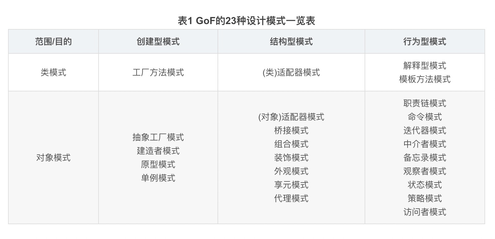

<center><font size=10 color="blue"> 设计模式 </font></center>

[原则比模式重要](#1、赖倒置原则（DIP）)，[技法比模式重要](#重构关键技法)

# 简介

## 课程目标：

* **理解松耦合设计思想**
* **掌握面向对象设计原则**
* **掌握重构技法改善设计**
* **掌握GOF核心设计模式**

## 什么是设计模式

"每一个模式描述了一个在我们周围不断重复发生的问题，以及该问题的解决方案的核心。这样，你就能一次又一次重复地使用该方案而不必做重复劳动"。
<p align="right">——Christopher Alexander</p>

## GOF设计模式

* 历史性著作《设计模式：可复用面向对象软件基础》一书中描述了23种经典面向对象设计模式，创立了模式在软件设计中的地位。
* 由于《设计模式》一书确定了设计模式的地位，通常所说的设计模式隐含地表示"面向对象设计模式"。但这并不意味"设计模式"就等于"面向对象设计模式"。

## 从面向对象谈起

* 底层思维：向下，如何把握机器底层从微观理解对象构造
    * 语言构造
    * 编译转换
    * 内存模型
    * 运行时机制

* 抽象思维：向上，如何将我们的周围世界抽象为程序代码
    * 面向对象
    * 组件封装
    * 设计模式
    * 架构模式

## 深入理解面向对象：(向下 / 向上)

* 向下：深入理解三大面向对象机制
    * 封装，隐藏内部实现
    * 继承，复用现有代码
    * 多态，改写对象行为

* 向上：深刻把握面向对象机制所带来的抽象意义，理解如何使用这些机制来表达现实世界，掌握什么是"好的面向对象设计"

## 软件设计固有的复杂性

建筑商从来不会去想给一栋已建好的100层高的楼房底下再修建一个小地下室——这样做花费极大而且注定要失败。然而令人惊奇的是，软件系统的用户在要求作出类似改变时却不会仔细考虑，而且他们认为这只是需要简单编程的事。
<p align="right">——Object-Oriented Analysis and Design with Applications</p>

## 软件设计复杂的根本原因：(**<font size=10 color="red">变化</font>**)

* 客户需求的变化
* 技术平台的变化
* 开发团队的变化
* 市场环境的变化
* ......

## 如何解决复杂性？(**分解 / 抽象**)

* 分解
    * 人们对复杂性有一个常见的做法：即分而治之，将大问题分解为多个小问题，将复杂问题分解为多个简单问题

* 抽象
    * 更高层次来讲，人们处理复杂性有一个通用的技术，即抽象。由于不能掌握全部的复杂对象，我们选择忽视它的非本质细节，而去处理泛化和理想化了的对象模型。

**<font size=10 color="blue">重点：掌握抽象思维</font>**

### 分解例子：[(divide_shape.go)](./example/divide_abstract/divide_shape/divide_shape.go)

> ```go
> package divide_shape
> 
> import (
> 	"fmt"
> 	"math"
> )
> 
> type Point struct {
> 	X, Y float64
> }
> 
> type Line struct {
> 	Start, End Point
> }
> type Rect struct {
> 	Width  float64
> 	Height float64
> 	LeftUp Point
> }
> 
> // Circle 新增需求画圆，新增结构体Circle
> type Circle struct {
> 	Center Point
> 	Radius float64
> }
> 
> type RadioButton struct {
> 	Checked bool
> }
> 
> type Form struct {
> 	rdoLine   RadioButton
> 	rdoRect   RadioButton
> 	rdoCircle RadioButton // 改变
> }
> 
> type MainForm struct {
> 	Form
> 
> 	p1, p2 Point
> 	lines  []Line
> 	rects  []Rect
> 
> 	//改变
> 	circles []Circle
> }
> 
> func (th *MainForm) OnMouseDown(x, y float64) {
> 	th.p1.X = x
> 	th.p1.Y = y
> 	// 鼠标按下记录第一个点，继续其他处理...
> }
> 
> func (th *MainForm) OnMouseUp(x, y float64) {
> 	th.p2.X = x
> 	th.p2.Y = y
> 	// 鼠标抬起记录第二个点，根据选择构造对象并加入slice
> 	if th.rdoLine.Checked {
> 		line := Line{
> 			Start: th.p1,
> 			End:   th.p2,
> 		}
> 		th.lines = append(th.lines, line)
> 	} else if th.rdoRect.Checked {
> 		rect := Rect{
> 			Width:  math.Abs(th.p2.X - th.p1.X),
> 			Height: math.Abs(th.p2.Y - th.p1.Y),
> 			LeftUp: th.p1,
> 		}
> 		th.rects = append(th.rects, rect)
> 	} else if th.rdoCircle.Checked { // 改变
> 		circle := Circle{
> 			Radius: math.Abs(th.p2.X - th.p1.X),
> 			Center: th.p1,
> 		}
> 		th.circles = append(th.circles, circle)
> 	}
> 
> 	// ...
> 	th.OnPain()
> }
> 
> func (th *MainForm) OnPain() {
> 	// 针对直线
> 	for _, p := range th.lines {
> 		fmt.Printf("e.Graphics.DrawLine(Pens.Red, %f, %f, %f, %f)",
> 			p.Start.X, p.Start.Y, p.End.X, p.End.Y)
> 	}
> 
> 	// 针对矩形
> 	for _, r := range th.rects {
> 		fmt.Printf("e.Graphics.DrawRectangle(Pens.Red, %v, %f, %f)",
> 			r.LeftUp, r.Width, r.Height)
> 	}
> 
> 	// 改变：针对圆形
> 	for _, c := range th.circles {
> 		fmt.Printf("e.Graphics.DrawCircle(Pens.Red, %v, %f)",
> 			c.Center, c.Radius)
> 	}
> 	// ...
> }
> 
> ```

### 抽象例子：[(abstract_shape.go)](./example/divide_abstract/abstract_shape/abstract_shape.go)

> ``` go
>package abstract_shape
> 
> import (
> 	"fmt"
> 	"math"
> )
> 
> type Shape interface {
> 	Draw()
> }
> type Point struct {
> 	X, Y float64
> }
> type Line struct {
> 	Start, End Point
> }
> 
> // Draw Line实现自己的Draw，负责画自己
> func (th *Line) Draw() {
> 	fmt.Printf("e.Graphics.DrawLine(Pens.Red, %f, %f, %f, %f)",
> 		th.Start.X, th.Start.Y, th.End.X, th.End.Y)
> }
> 
> type Rect struct {
> 	LeftUp Point
> 	Width  float64
> 	Height float64
> }
> 
> // Draw Rect实现自己的Draw，负责画自己
> func (th *Rect) Draw() {
> 	fmt.Printf("e.Graphics.DrawRectangle(Pens.Red, %v, %f, %f)",
> 		th.LeftUp, th.Width, th.Height)
> }
> 
> // Circle 新增需求画圆，新增结构体Circle
> type Circle struct {
> 	Center Point
> 	Radius float64
> }
> 
> // Draw Circle实现自己的Draw，负责画自己
> func (th *Circle) Draw() {
> 	fmt.Printf("e.Graphics.DrawCircle(Pens.Red, %v, %f)",
> 		th.Center, th.Radius)
> }
> 
> type RadioButton struct {
> 	Checked bool
> }
> 
> type Form struct {
> 	rdoLine   RadioButton
> 	rdoRect   RadioButton
> 	rdoCircle RadioButton // 改变
> }
> 
> type MainForm struct {
> 	Form
> 	p1, p2 Point
> 	shapes []Shape
> }
> 
> func (th *MainForm) OnMouseDown(x, y float64) {
> 	th.p1.X = x
> 	th.p1.Y = y
> 	// 鼠标按下记录第一个点，继续其他处理...
> }
> 
> func (th *MainForm) OnMouseUp(x, y float64) {
> 	th.p2.X = x
> 	th.p2.Y = y
> 	// 鼠标抬起记录第二个点，根据选择构造对象并加入slice
> 	if th.rdoLine.Checked {
> 		line := &Line{
> 			Start: th.p1,
> 			End:   th.p2,
> 		}
> 		th.shapes = append(th.shapes, line)
> 	} else if th.rdoRect.Checked {
> 		rect := &Rect{
> 			Width:  math.Abs(th.p2.X - th.p1.X),
> 			Height: math.Abs(th.p2.Y - th.p1.Y),
> 			LeftUp: th.p1,
> 		}
> 		th.shapes = append(th.shapes, rect)
> 	} else if th.rdoCircle.Checked { // 改变
> 		circle := &Circle{
> 			Radius: math.Abs(th.p2.X - th.p1.X),
> 			Center: th.p1,
> 		}
> 		th.shapes = append(th.shapes, circle)
> 	}
> 	// ...
> 	th.OnPain()
> }
> 
> func (th *MainForm) OnPain() {
> 	// 针对所有形状
> 	for _, s := range th.shapes {
> 		s.Draw() // 多态调用，各负其责
> 	}
> 
> 	// ...
> }
> 
> ```

## 软件设计的目标：(**<font size=10 color="red">复用</font>**)

什么是好的软件设计？软件设计的金科玉律：复用

---

# 面向对象设计原则

## 面向对象设计，为什么？

变化是复用的天敌！ 面向对象设计最大的优势在于：  **<font size=10 color="red">抵御变化！</font>**

## 重新认识面向对象

* 理解隔离变化
    * 从宏观层面来看，面向对象的构建方式更能适应软件的变化，能将变化所带来的影响减为最小
* 各司其职
    * 从微观层面来看，面向对象的方式更强调各个类的"责任"
    * 由于需求变化导致的新增类型，不应该影响原来类型的实现——就是所谓各负其责
* 对象是什么？
    * 从语言实现层面来看，对象封装了代码和数据
    * 从规格层面讲，对象是一系列可被使用的公共接口
    * 从概念层面讲，对象是某种拥有责任的抽象

## 1、赖倒置原则（DIP）

<font color="red">【重点】：设计模式种类的判别，都是依赖设计原则来做评判，设计原则比具体的模式更重要，可以根据设计原则，设计千差万别的模式。重点要关注`稳定的部分`，`变化的部分`
，用原则评判模式，学习设计模式时，更多的以变化的眼光，找寻`变化点`，分出`稳定的部分`，`变化的部分`，`将变化的部分赶到某个地方，让它在那里蹦迪，而不影响破坏稳定的部分`。</font>

* 高层模块（<font color="red">稳定</font>）不应该依赖于低层模块（<font color="blue">变化</font>），二者都应该依赖于抽象（<font color="red">稳定</font>）。
* 抽象（<font color="red">稳定</font>）不应该依赖于实现细节（<font color="blue">变化</font>），实现细节应该依赖于抽象（<font color="red">稳定</font>）。

## 2、开放封闭原则（OCP）

* 对扩展开放，对更改封闭。
* 类模块应该是可扩展的，但是不可修改。

## 3、单一职责原则（SRP）

* 一个类应该仅有一个引起它变化的原因。
* 变化的方向隐含着类的责任。

## 4、Liskov替换原则（LSP）

* 子类必须能够替换它们的基类（IS-A）。
* 继承表达类型抽象。

## 5、接口隔离原则（ISP）

* 不应该强迫客户程序依赖它们不用的方法。
* 接口应该小而完备。

## 6、优先使用组合，而不是类继承

* 类继承通常为"白箱复用"，对象组合通常为"黑箱复用"。
* 继承在某种程度上破坏了封装性，子类父类耦合度高。
* 而对象组合则只要求被组合的对象具有良好定义的外部接口，耦合度低

## 7、封装变化点

* 使用封装来创建对象之间的分界层，让设计者可以在分界层的一侧进行修改，而不会对另一侧产生不良的影响，从而实现层次间的松耦合

## 8、针对接口编程，而不是针对实现编程

* 不将变量类型声明为某个特定的具体类，而是声明为某个接口。（不绝对，主要是针对业务类型）
* 客户程序无需获知对象的具体类型，只需要知道对象所具有的接口。
* 减少系统中各部分的依赖关系，从而实现"高内聚，松耦合"的类型设计方案。

面向接口设计

产业强盛的标志：**<font size=10 >接口标准化</font>**

## 将设计原则提升为设计经验

1. 设计习语 Design Idioms
    * Design Idioms 描述与特定编程语言相关的低层模式，技巧，惯用法。

2. 设计模式 Design Patterns
    * Design Patterns 主要描述的是"类与相互通信的对象之间的组织关系"，包括他们的角色、职责、协作方式等方面。
    * 主要解决变化中的复用性问题。

3. 架构模式 Architectural Patterns
    * Architectural Patterns 描述系统中与基本结构组织关系密切的高层模式，包括子系统划分、职责、以及如何组织它们之间的关系的规则。

---

# GOF-23 模式分类



## 1、从目的对模式分类

### 创建型（Creational）模式

将对象的部分创建工作延迟到子类或者其他对象，从而应对需求变化对对象创建具体类型实现引来的冲击。

* [Singleton](./gof_23/Singleton.md)
* [Prototype](./gof_23/Prototype.md)
* [Factory Method](./gof_23/FactoryMethod.md)
* [Abstract Factory](./gof_23/AbstractFactory.md)
* [Builder](./gof_23/Builder.md)

### 结构型（Structural）模式

通过类继承或者对象组合获得灵活的结构，从而应对需求变化对对象的结构带来的冲击。

* [Proxy](./gof_23/Proxy.md)
* [Adapter](./gof_23/Adapter.md)
* [Bridge](./gof_23/Bridge.md)
* [Decorator](./gof_23/Decorator.md)
* [Facade](./gof_23/Facade.md)
* [Flyweight](./gof_23/Flyweight.md)
* [Composite](./gof_23/Composite.md)

### 行为型（Behavioral）模式

通过类继承或者对象组合来划分类与对象间的职责，从而应对需求变化对多个交互的对象带来的冲击。

* [Template Method](./gof_23/TemplateMethod.md)
* [Strategy](./gof_23/Strategy.md)
* [Command](./gof_23/Command.md)
* [Chain of Responsibility](./gof_23/ChainofResponsibility.md)
* [State](./gof_23/State.md)
* [Observer / Event](./gof_23/Observer.md)
* [Mediator](./gof_23/Mediator.md)
* [Iterator](./gof_23/Iterator.md)
* [Visitor](./gof_23/Visitor.md)
* [Memento](./gof_23/Memento.md)
* [Interpreter](./gof_23/Interpreter.md)

## 2、从范围对模式分类

### 类模式

`类模式`处理类与子类的静态关系。

* [Factory Method](./gof_23/FactoryMethod.md)
* [(类)Adapter](./gof_23/Adapter.md)
* [Interpreter](./gof_23/Interpreter.md)
* [Template Method](./gof_23/TemplateMethod.md)

### 对象模式

`对象模式`处理对象间的动态关系。

* [Singleton](./gof_23/Singleton.md)
* [Prototype](./gof_23/Prototype.md)
* [Abstract Factory](./gof_23/AbstractFactory.md)
* [Builder](./gof_23/Builder.md)
* [Proxy](./gof_23/Proxy.md)

* [(对象)Adapter](./gof_23/Adapter.md)
* [Bridge](./gof_23/Bridge.md)
* [Decorator](./gof_23/Decorator.md)
* [Facade](./gof_23/Facade.md)
* [Flyweight](./gof_23/Flyweight.md)
* [Composite](./gof_23/Composite.md)

* [Strategy](./gof_23/Strategy.md)
* [Command](./gof_23/Command.md)
* [Chain of Responsibility](./gof_23/ChainofResponsibility.md)
* [State](./gof_23/State.md)
* [Observer / Event](./gof_23/Observer.md)
* [Mediator](./gof_23/Mediator.md)
* [Iterator](./gof_23/Iterator.md)
* [Visitor](./gof_23/Visitor.md)
* [Memento](./gof_23/Memento.md)
*

## 3、从封装变化角度对模式分类

### 组件协作

* 现代软件专业分工之后的第一个结果是 "`框架`与`应用`程序的划分"，"<u>`组件协作`</u>" 模式通过`晚期绑定`，来实现框架与应用程序之间的`松耦合`，是二者之间协作时常用的模式。
* 典型模式：
    * [Template Method](./gof_23/TemplateMethod.md)
    * [Strategy](./gof_23/Strategy.md)
    * [Observer / Event](./gof_23/Observer.md)

### 单一职责

* [Decorator](./gof_23/Decorator.md)
* [Bridge](./gof_23/Bridge.md)

对象创建

* [Factory Method](./gof_23/FactoryMethod.md)
* [Abstract Factory](./gof_23/AbstractFactory.md)
* [Prototype](./gof_23/Prototype.md)
* [Builder](./gof_23/Builder.md)

### 对象性能

* [Singleton](./gof_23/Singleton.md)
* [Flyweight](./gof_23/Flyweight.md)

### 接口隔离

* [Facade](./gof_23/Facade.md)
* [Proxy](./gof_23/Proxy.md)
* [Mediator](./gof_23/Mediator.md)
* [Adapter](./gof_23/Adapter.md)

### 状态变化

* [Memento](./gof_23/Memento.md)
* [State](./gof_23/State.md)

### 数据结构

* [Composite](./gof_23/Composite.md)
* [Iterator](./gof_23/Iterator.md)
* [Chain of Responsibility](./gof_23/ChainofResponsibility.md)

### 行为变化

* [Command](./gof_23/Command.md)
* [Visitor](./gof_23/Visitor.md)

### 领域问题

* [Interpreter](./gof_23/Interpreter.md)

## 重构获得模式 Refactoring to Patterns

* 什么面向对象设计模式是 "好的面向对象设计"，所谓 `"好的面向对象设计"` 是指那些可以满足 `"应对变化，提高复用"` 的设计。
* 现代软件设计的特征是 "需求的频繁变化"。设计模式的要点是 "寻找变化点，然后在变化点处应用设计模式，从而来更好地应对需求的变化"。`"什么时候、什么地点应用设计模式"` 比 `"理解设计模式结构本身"` 更为重要。
* 设计模式的应用不宜先入为主，一上来就使用设计模式是设计模式的最大误用。没有一步到位的设计模式。敏捷软件开发实践提倡的 `"Refactoring to Patterns"` 是目前普遍公认的最好的使用设计模式的方法。

## 重构关键技法

<font color="red">【重点】：原则很重要，技法也很重要，对技法关键词的理解，比某个单纯的模式重要的多，因为所有模式都会使用这些技法。</font>

1. **静态 -> 动态**
2. **早绑定 -> 晚绑定**
3. **继承 -> 组合**
4. **编译时依赖 -> 运行时依赖**
5. **紧耦合 -> 松耦合**

# 参考

* [23个设计模式](https://www.bilibili.com/video/BV1kW411P7KS?p=9&spm_id_from=pageDriver)

