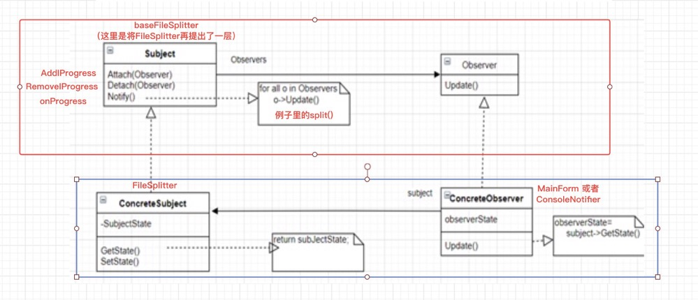

 Observer Method [观察者模式] 

[GOF_23](../DesignPatterns.md)

# "组件协作"模式：

* 现代软件专业分工之后的第一个结果是 "`框架`与`应用`程序的划分"，"<u>`组件协作`</u>" 模式通过`晚期绑定`，来实现框架与应用程序之间的`松耦合`，是二者之间协作时常用的模式。
* 典型模式：
  * [Template Method](./TemplateMethod.md)
  * [Strategy](./Strategy.md)
  * [Observer / Event](./Observer.md)

# 动机

*  在软件构建过程中，我们需要为某些对象建立一种“通知依赖关系”——一个对象（目标对象）的状态发生改变，所有的依赖对象（观察者对象）都将得到通知。如果这样的依赖关系过于紧密，将使软件不能很好的抵御变化。
* 使用面向对象技术，可以将这种依赖关系弱化，并形成一种稳定的依赖关系。从而实现软件体系结构的松耦合。

[代码：Observer_bad ](../example/go/behavioral/Observer/bad/observer_bad.go)

[代码：Observer_good](../example/go/behavioral/Observer/good/observer_good.go)

[代码：Observer_perfect](../example/go/behavioral/Observer/perfect/observer_perfect.go)

[代码：Observer_test](../example/go/behavioral/Observer/observer_test.go)

# 模式定义

定义对象间的一种一对多（`变化`）的依赖关系，以便挡一个对象（Subject）的状态发生改变时，所有依赖于它的对象都得到通知并自动更新。

——《设计模式》GOF

# 结构

# 要点总结

* 使用面向对象的抽象，Observer模式使得我们可以独立地改变目标与观察者，从而使二者之间的依赖关系达成松耦合。
* 目标发送通知时，无需指定观察者，通知（可以携带通知信息作为参数）会自动传播。
* 观察者自己决定是否需要订阅通知，目标对象对此一无所知。
* Observer模式是基于事件的UI框架中非常常用的设计模式，也是MVC模式的一个重要组成部分。

# 参考

* [23个设计模式](https://www.bilibili.com/video/BV1kW411P7KS?p=9&spm_id_from=pageDriver)