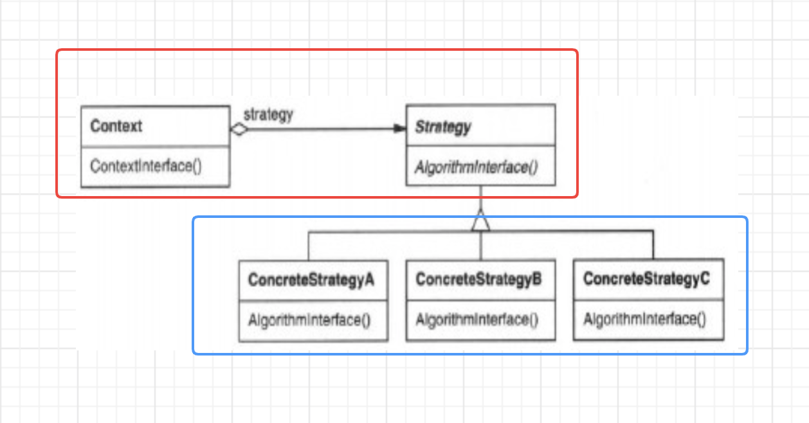

 Strategy [策略模式] 

# [GOF_23](../DesignPatterns.md)

# "组件协作"模式：

* 现代软件专业分工之后的第一个结果是 "`框架`与`应用`程序的划分"，"<u>`组件协作`</u>" 模式通过`晚期绑定`，来实现框架与应用程序之间的`松耦合`，是二者之间协作时常用的模式。
* 典型模式：
  * [Template Method](./TemplateMethod.md)
  * [Strategy](./Strategy.md)
  * [Observer / Event](./Observer.md)

# 动机

* 在软件构建过程中，某些对象使用的算法可能多种多样，经常改变，如果将这些算法都编码到对象中，将会使对象变得异常复杂；而且有时候支持不使用的算法也是一种性能负担。
* 如何在运行时根据需要透明地更改对象的算法？将算法与对象本身解耦，从而避免上述问题？

[代码：strategy_bad ](../example/go/behavioral/Strategy/bad/strategy_bad.go)

[代码：strategy_good](../example/go/behavioral/Strategy/good/strategy_good.go)

[代码：strategy_test](../example/go/behavioral/Strategy/strategy_test.go)

# 模式定义

定义一系列算法，把它们一个个封装起来，并且使它们可互相替换（`变化`）。该模式使得算法可独立于使用它的客户程序（`稳定`）而变化（`扩展，子类化`）。

——《设计模式》GOF

# 结构（Structure）

# 要点总结

* Strategy及其子类为组件提供了一系列可重用的算法，从而可以使得类型在`运行时`方便地根据需要在各个算法之间进行切换。
* Strategy模式提供了用条件判断语句以外的另一种选择，消除条件判断语句，就是在解耦合。含有`许多条件判断`语句的代码通常都需要Strategy模式。
* 如果Strategy对象没有实例变量，那么各个上下文可以共享同一个Strategy对象，从而节省对象开销。

# 参考

* [23个设计模式](https://www.bilibili.com/video/BV1kW411P7KS?p=9&spm_id_from=pageDriver)