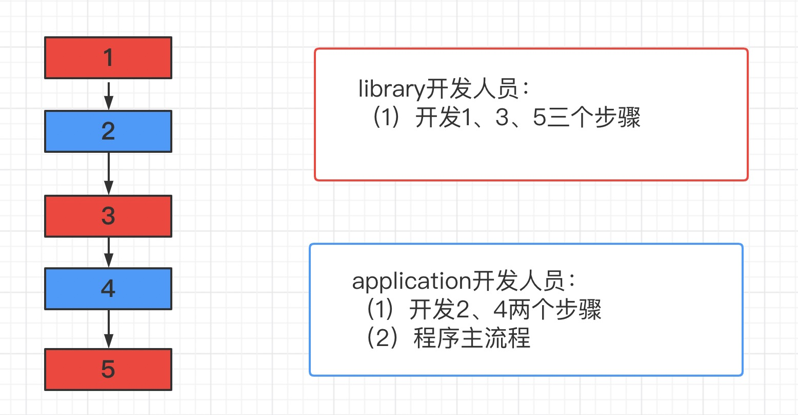
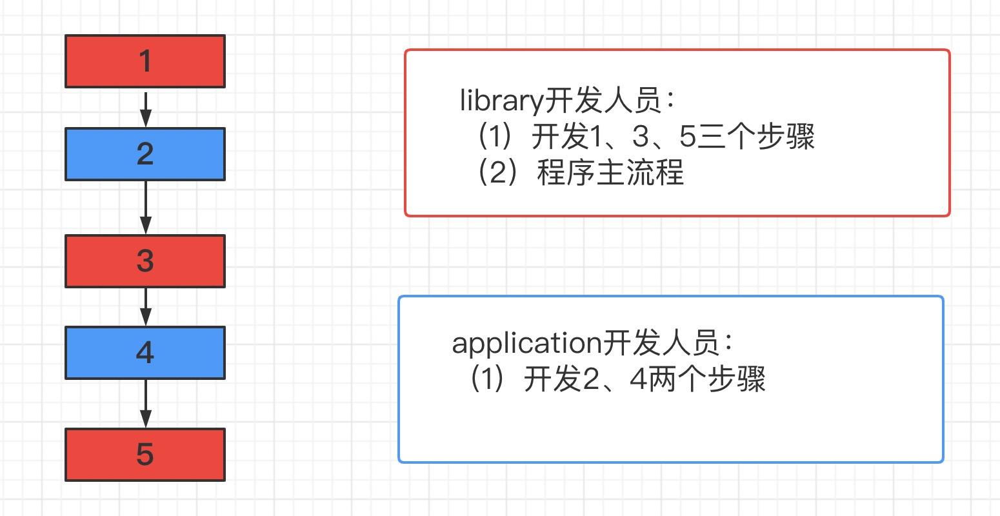
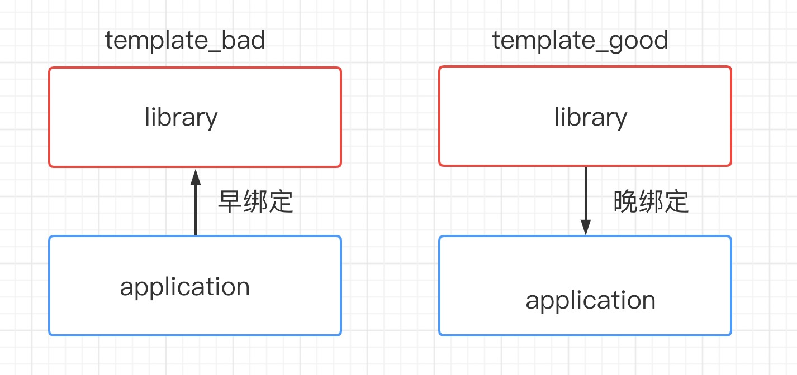
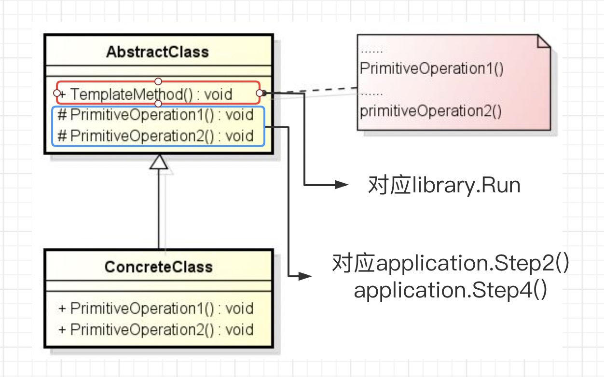

 Template Method [模板方法模式] 

# [GOF_23](../DesignPatterns.md)

# "组件协作"模式：

* 现代软件专业分工之后的第一个结果是 "`框架`与`应用`程序的划分"，"<u>`组件协作`</u>" 模式通过`晚期绑定`，来实现框架与应用程序之间的`松耦合`，是二者之间协作时常用的模式。
* 典型模式：
  * [Template Method](./TemplateMethod.md)
  * [Strategy](./Strategy.md)
  * [Observer / Event](./Observer.md)

# 动机

* 在软件构建过程中，对于某一项任务，它常常有`稳定`的整体操作结构，但各个子步骤却有很多`改变`的需求，或者由于固有的原因（比如框架与应用之间的关系）而无法和任务的整体结构同时实现。 
* 如何在确定`稳定`操作结构的前提下，来灵活应对各个子步骤的`变化`或者`晚期`实现需求？

[代码：template_bad ](../example/go/behavioral/Template_Method/bad/template_bad.go)

[代码：template_good](../example/go/behavioral/Template_Method/good/template_good.go)

[代码：template_test](../example/go/behavioral/Template_Method/template_test.go)

# 结构化软件设计流程

[template_bad] :

[template_good] :

# 早绑定与晚绑定

# 模式定义

定义一个操作中的算法的骨架（`稳定`），而将一些步骤延迟（`变化`）到子类中。Template Method使得子类可以不改变（`复用`）一个算法的结构即可重定义（`override 重写`）该算法的某些特定步骤。

——《设计模式》GOF

# 结构（Structure）

# 要点总结

* Template Method模式是一种非常**`基础性`**的设计模式，在面向对象系统中有着大量的应用。它用最简洁的机制（c++虚函数、go接口的多态性）为很多应用程序框架提供了灵活的扩展点，是代码复用方面的基本实现结构。
* 除了可以灵活应对子步骤的变化外，"不要调用我，让我来调用你" 的反响控制结构是Template Method的典型应用。
* 在具体实现方面，被Template Method调用的虚方法可以具体实现，也可以没有任何实现（抽象方法、纯虚方法），但一般推荐将它们设置为protected方法（此处针对C++，go中可能需要用package的导出管理方式）。

# 参考

* [23个设计模式](https://www.bilibili.com/video/BV1kW411P7KS?p=9&spm_id_from=pageDriver)

